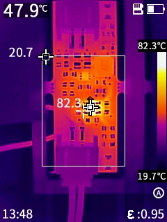

# Stücklistenänderungen

1. R5 = 20k
1. R1 = 20k

# Thermokamera

Tests mit 1800 mAh Lipo durchgeführt.

## Last

Vbat = 3,9 V

Last 500 mA und 700 mA

 

## Ladebetrieb

Vbat = 3,9 V, R2 = 2k, Ladestrom 0,5 A

VBUS = 5 V, rechts mit zusätzlichem Laststrom 0,5 A

  

---

Vbat = 3,9 V, **R2 = 2,2k**, Ladestrom 0,454 mA

 

---

Vbat = 3,9 V, **R2 = 3k**, Ladestrom 0,333 mA

VBUS = 5 V, rechts VBUS = 5,4 V

 

---

# Verbrauch im Leerlauf

| Vbat (V) | Ibat (µA) | Low Bat LED |
| -------- | --------- | ----------- |
| 3,2      | 821       | an          |
| 3,3      | 807       | an          |
| 3,4      | 794       | an          |
| 3,5      | 782       | an          |
| 3,6      | 772       | an          |
| 3,7      | 663       | aus         |
| 3,8      | 649       | aus         |
| 3,9      | 636       | aus         |
| 4,0      | 623       | aus         |
| 4,1      | 613       | aus         |
| 4,2      | 601       | aus         |

